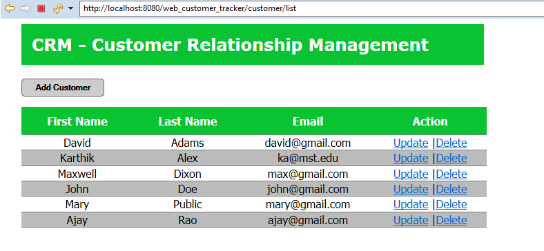
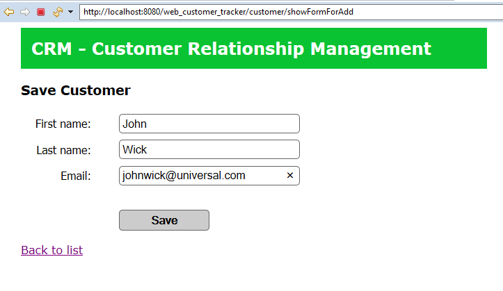

# SpringHibernateWebApp
A simple Web App to keep track of customers and perform CRUD operations on Customer table.
A simple web page is created using JSP and CSS. The MySQL server holds CUSTOMER table. From the web app, user can add, delete and update the customers using Spring MVC and Hibernate Frameworks.

Home Page

Updation page

